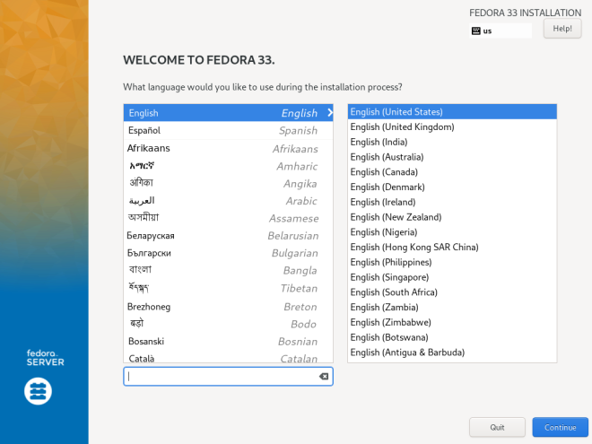
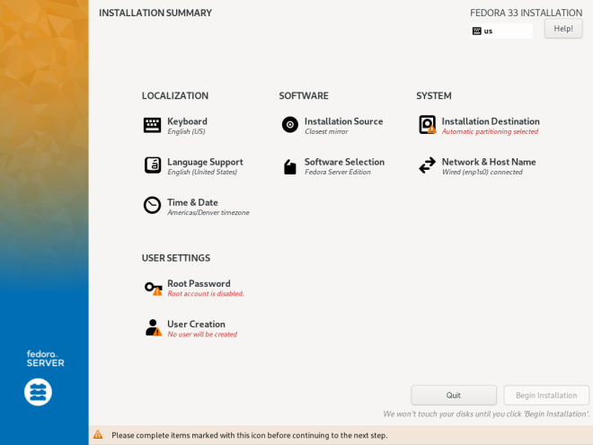
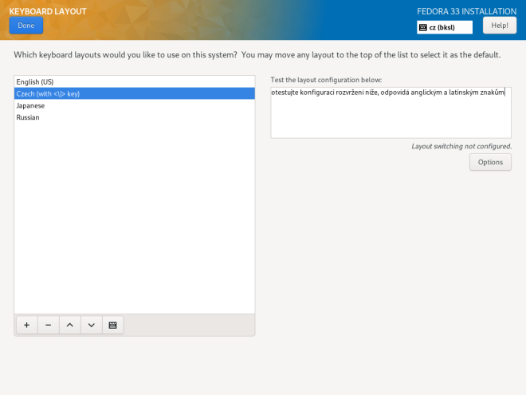
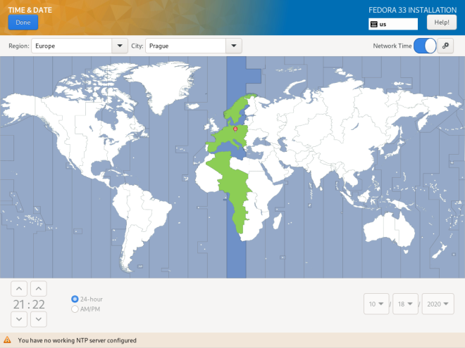
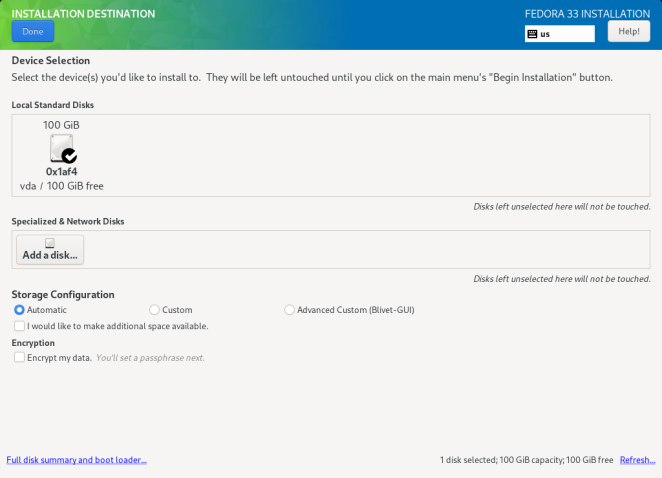
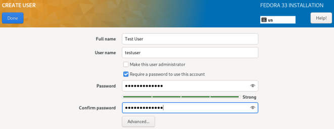
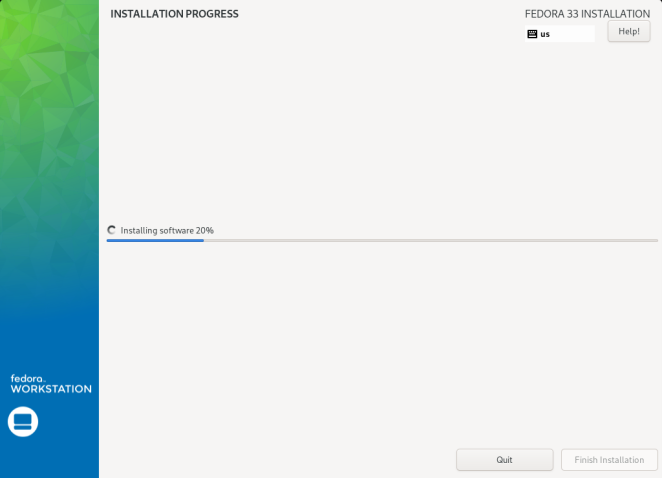

# Installing with Anaconda

Once you've booted from your USB, the zodium ISO will launch the **Anaconda** installer automatically. Follow the steps below to complete your installation.

---

## Step 1 — Language Selection

The first screen you'll see asks you to select your language and region. This sets the language for the installer and the installed system.

- Select your language from the left column
- Select your region/variant from the right column
- Click **Continue**

---

## Step 2 — Installation Summary (Hub)

After selecting your language, you'll land on the **Installation Summary** hub. This is the main screen — it shows all the configuration sections you need to complete before installation can begin.

Sections marked with a **warning triangle** are required before you can proceed. You'll typically need to configure:

- **Keyboard** — layout for your system
- **Time & Date** — your timezone
- **Installation Destination** — where to install

> **Note:** Sections without a warning are already configured with sensible defaults and can be left as-is.

---

## Step 3 — Keyboard Layout

Click **Keyboard** from the hub.

- Your system language keyboard is usually pre-selected
- You can add additional layouts using the `+` button
- Click **Done** when finished

---

## Step 4 — Time & Date

Click **Time & Date** from the hub.

- Click your region on the map, or use the dropdowns at the top to select **Region** and **City**
- Toggle **Network Time** on if you're connected to the internet — this keeps your clock accurate automatically
- Click **Done** when finished

---

## Step 5 — Installation Destination

This is the most important step. Click **Installation Destination** from the hub.

You'll see your available disks. Select the disk you want to install to by clicking it — a checkmark will appear.

### Storage Configuration

Under **Storage Configuration**, you have two options:

**Automatic** *(recommended)*
> Anaconda will partition the disk for you. If the disk already has data, it will ask how to handle it.

**Custom**
> Manually define your partition layout. Only use this if you know what you're doing — e.g. dual booting or custom partition schemes.

> **Warning:** Installation will erase all data on the selected disk. Make sure you've backed up anything important.

Click **Done** when your disk is selected. If using automatic partitioning, a summary dialog will appear — click **Accept Changes** to confirm.

---

## Step 6 — User Creation

Before starting the installation, Anaconda will ask you to create your user account.

- Enter your **Full Name** and **Username**
- Set a **Password** and confirm it
- Check **Make this user administrator** to give your account sudo access
- Click **Done** when finished
> Enable Root User now if you root user access , this can reduce security & a sudo user should be enough for most of your needs
---

## Step 7 — Begin Installation

Once all required sections in the hub have a green checkmark, the **Begin Installation** button will become active. Click it — the installer will now partition your disk and write the system image. This typically takes **5–15 minutes** depending on your hardware.

---

## Step 8 — Complete & Reboot

When the progress bar completes, a **Finish Installation** button will appear.

- Click **Finish Installation**
- Remove your USB drive
- Your system will reboot into zodium