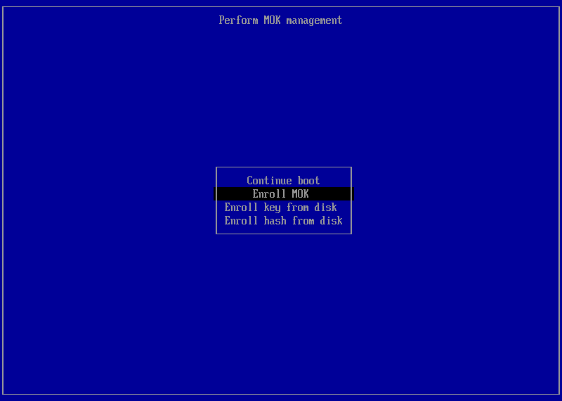
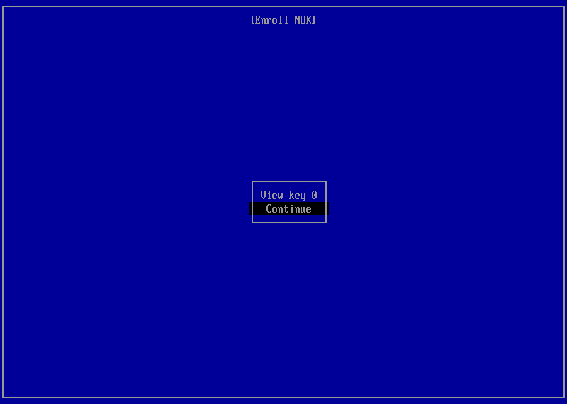
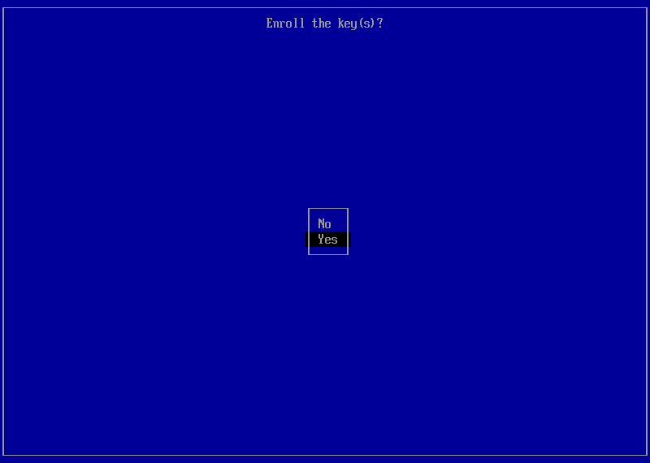
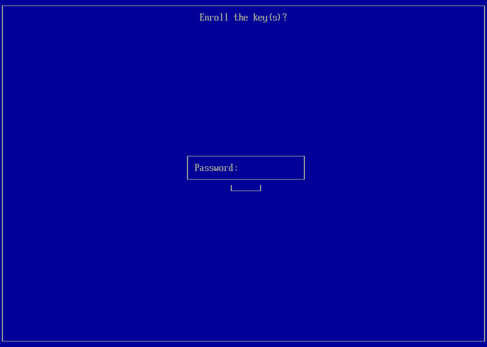
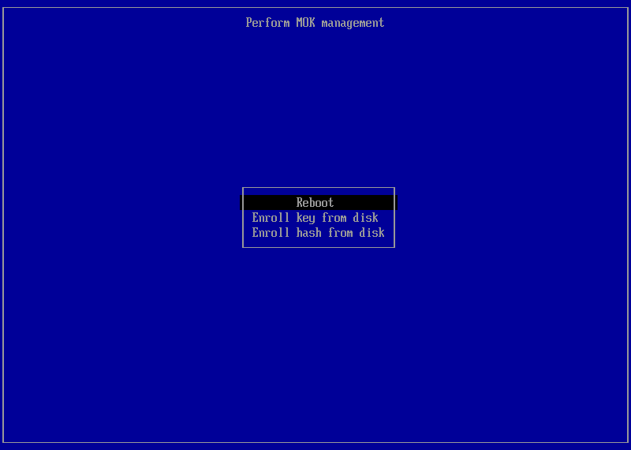

# Post-Install Setup

After your system reboots, you may be greeted with a blue **MOK Management** screen before reaching your desktop. This is normal — it's part of enrolling the zodium kernel signing key so your system trusts it.

---

## What is MOK?

**MOK** (Machine Owner Key) is a key management system that works alongside Secure Boot. zodium signs its kernel modules with a custom key, and this enrollment step tells your firmware to trust it. You only need to do this once.

> MOK enrollment is optional if you don't want `secure boot` support
---

## Step 1 — Enroll MOK

On the blue MOK Management screen, select **Enroll MOK** and press `Enter`.



---

## Step 2 — View Key (Optional)

You'll be asked if you want to view the key before enrolling. Select **Continue** to skip viewing it, or **View Key** if you're curious. Either way, proceed to the next screen.



---

## Step 3 — Confirm Enrollment

Select **Yes** to confirm you want to enroll the key.



---

## Step 4 — Enter the Password

You'll be prompted to enter a password to authorize the enrollment.



Enter the following password exactly as shown:

```
zodium
```

> **Note:** The password field won't show any characters as you type — this is normal. Type it and press `Enter`.

---

## Step 5 — Reboot

Once the password is accepted, select **Reboot** from the MOK Management screen.



Your system will reboot and this time boot straight into zodium.

---

> **Note:** If you don't see the MOK screen at all, your system either has Secure Boot disabled or the key was already enrolled — either way, you're good to go.